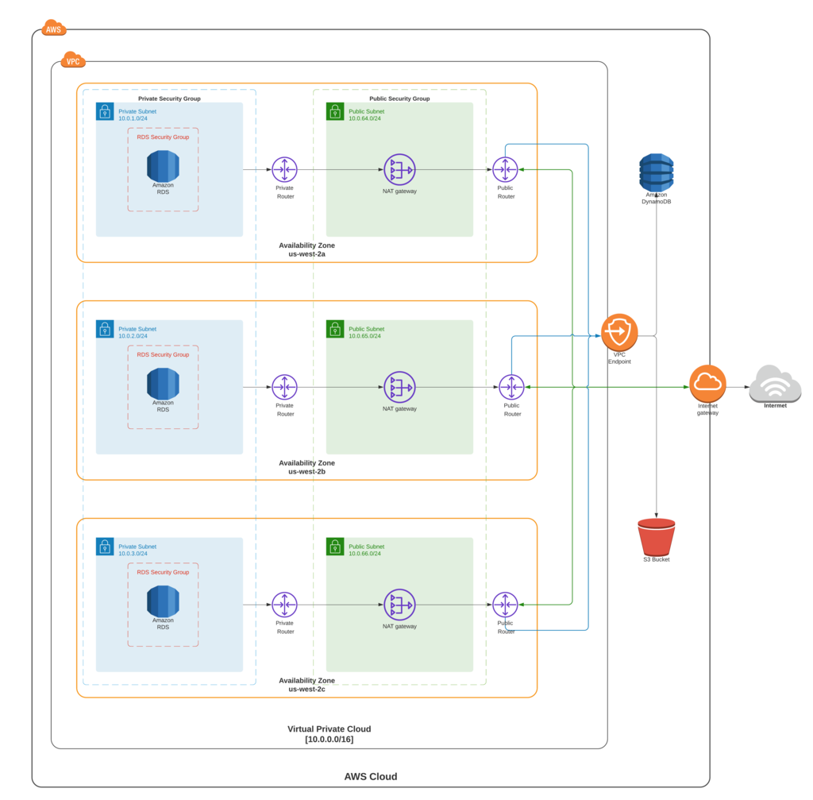

# AWS managed Infrastructure through Terraform

The purpose of this project is to provision and manage AWS infrastructure as code (IaC). The project is leveraging Terraform modules to create the resources. The modular architecture maintains the code in separate folder so as the number of resource and/ complexity grows maintainability doesn't become an issue.  All the modules are registered in `terraform --> main.tf`, which provides a centralized configuration for choosing which resource should/ shouldn't be provisioned.

Benefits of this project:
1. **Operational Excellence** - The `environment variables` allows you to replicate the resources across different project environment such as `pord`, `test`, `dev` etc. 
2. **Security** - Security best-practices are unified in templates/ JSON files which can be easily edited and reused multiple times.
3. **Reliability** - The resource states stored in an S3 bucket, so any unwanted manual changes to the resources can be easily identified and reverted back. Changes to the IaC can tagged in `package.json` through `npn-version [patch|minor|major]` and version controlled by Git.
4. **Cost Optimization** - Automates the AWS resource spin up, which eliminates the need of manual processes/ tasks altogether.

## Prerequisites
Create a `~/.bash_profile` and add `access-key`, `secret-key` and `aws-region` and  as environment variables.
~~~
AWS_ACCESS_KEY_ID="access-key"
AWS_SECRET_ACCESS_KEY="secret-key"
AWS_DEFAULT_REGION="aws-region"
~~~

Go to the `/terraform` directory and source the bash profile

~~~
source ~/.bash_profile
~~~

Create an S3 Bucket named `managed-infrastructure-tfstate` to store the tfstate. you can create the bucket 
via the AWS Management Console or via the CLI. 

~~~
aws s3 mb s3://managed-infrastructure-tfstate
~~~

## Terraform Commands
Initialize terraform working directory.
~~~
terraform init
~~~
List the resources to be created via the script. Allows users to review, before applying the plan. 
~~~
terrafomm plan
~~~
The command will also prompt you to provide:
* account_id
* environment
* rds_username
* rds_password

Apply the plan to create resources in AWS 
~~~
terraform apply
~~~
Destroy all the infrastructure managed via the terraform. 
~~~
terraform destroy
~~~